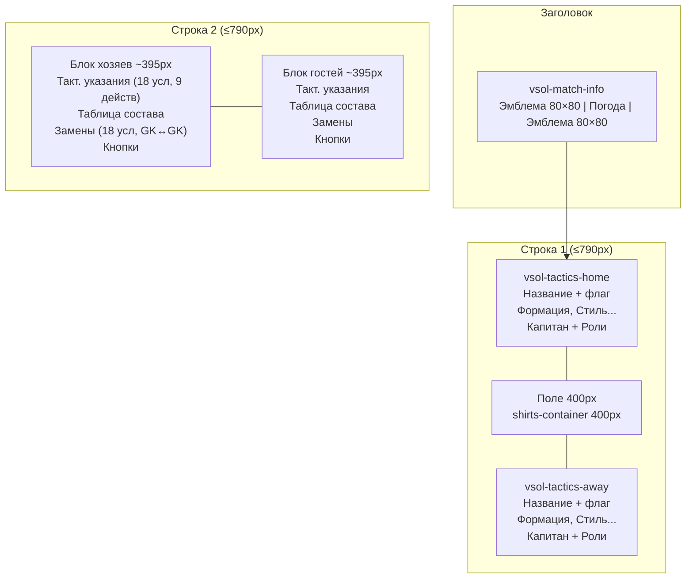

# Полировка UI калькулятора — Дизайн

## Обзор

Доработка UI калькулятора силы после редизайна макета. Основные изменения:

- Ширина контейнера ≤790px (вместо 800px) для вписывания в ячейку сайта
- Эмблемы клубов 80×80 и реальные названия команд с флагами в заголовке
- Уменьшение ширины player-cell в таблицах составов для предотвращения наложения
- Полноценные формы замен и тактических указаний для обеих команд (18 условий, 9 действий)
- Тактики из оригинальной mng_order (суперзащитная, защитная, нормальная, атакующая, все в атаку)
- Уникальные id для тактических колонок (`vsol-tactics-home`, `vsol-tactics-away`)
- Объединение капитана и ролей в один блок
- Фиксированная ширина shirts-container 400px
- Простой заголовок вкладки "Калькулятор"

## Архитектура

### Текущая архитектура (после редизайна)

```
createLayout()
├── weatherUI (id="vsol-weather-ui") — информация о матче
├── row1Table (620px, 3 колонки)
│   ├── createTacticsColumn('home') — 110px, без id
│   ├── fieldCol — 400px
│   └── createTacticsColumn('away') — 110px, без id
├── row2Container (620px, 2 блока inline-block)
│   ├── homeLineupWrapper (310px)
│   │   ├── homeLineupBlock.block (orders-table, player-cell=271px)
│   │   ├── captainRow
│   │   ├── rolesRow
│   │   └── [userTeamButtons: замены + тактические указания — только для команды пользователя]
│   └── awayLineupWrapper (310px)
│       ├── awayLineupBlock.block
│       ├── captainRow
│       ├── rolesRow
│       └── [opponentButtons]
├── synergyWrap — бонусы
└── clearBtn

Контейнер: #vsol-calculator-ui { width: 800px }
```

### Проблемы текущей архитектуры

1. `width: 800px` на контейнере — не влезает в `<td style="width:790px">`
2. `player-cell: 271px` → orders-table min-width ~411px, не влезает в 310px блок
3. Нет эмблем клубов, нет реальных названий команд с флагами
4. Замены и тактические указания только для команды пользователя
5. Условия замен — упрощённый список (5 вместо 18), действия — упрощённый (5 вместо 9)
6. Тактики: "Нормальная, Атакующая, Оборонительная, Контратака, Прессинг" — не соответствуют mng_order
7. Тактические колонки без id
8. Капитан и роли — отдельные блоки
9. `vsol-weather-ui` — неточное имя для блока информации о матче
10. Вкладка: "Калькулятор — {opponent} (дома/в гостях)" — слишком длинно

### Новая архитектура

```
createLayout()
├── matchInfoUI (id="vsol-match-info") — эмблемы + погода + посещаемость
├── row1Table (790px max, 3 колонки)
│   ├── createTacticsColumn('home', id="vsol-tactics-home") — flex
│   │   └── [капитан + роли — объединённый блок]
│   ├── fieldCol — 400px (shirts-container: width=400px fixed)
│   └── createTacticsColumn('away', id="vsol-tactics-away") — flex
│       └── [капитан + роли — объединённый блок]
├── row2Container (790px max, 2 блока)
│   ├── homeLineupWrapper (~395px)
│   │   ├── tacticalInstructionSlots (18 условий, 9 действий)
│   │   ├── homeLineupBlock.block (orders-table, player-cell уменьшен)
│   │   ├── substitutionSlots (18 условий, GK↔GK / полевой↔полевой)
│   │   └── buttons
│   └── awayLineupWrapper (~395px)
│       ├── tacticalInstructionSlots
│       ├── awayLineupBlock.block
│       ├── substitutionSlots
│       └── buttons
├── synergyWrap — бонусы
└── clearBtn

Контейнер: #vsol-calculator-ui { max-width: 790px; box-sizing: border-box }
```

### Диаграмма нового макета



## Компоненты и интерфейсы

### Модифицируемые функции

#### `addCSS()` — изменение стилей

Изменения CSS:
```css
/* Было */
#vsol-calculator-ui { width: 800px; ... }
#vsol-calculator-ui td.player-cell { width: 271px; }
#vsol-calculator-ui .select2-container--orders { width: 271px; }

/* Стало */
#vsol-calculator-ui { max-width: 790px; width: 100%; box-sizing: border-box; ... }
#vsol-calculator-ui td.player-cell { width: 170px; }
#vsol-calculator-ui .select2-container--orders { width: 170px; }
.shirts-container { width: 400px; pointer-events: none; }
```

Ширина player-cell: 170px. Суммарная ширина строки orders-table: 40 (order) + 170 (player) + 40 (style) + 60 (form) = 310px → влезает в блок ~395px.

#### `createWeatherUI()` → переименование id

Изменение: `container.id = 'vsol-weather-ui'` → `container.id = 'vsol-match-info'`

Добавление: строка с эмблемами клубов в начало таблицы информации о матче.

**Параметры** (новые): `homeTeamId`, `awayTeamId` — для формирования URL эмблем.

Эмблемы: ``

#### `createTacticsColumn(team, sideLabel, teamName, onChange)`

Изменения:
1. Добавить `td.id = 'vsol-tactics-' + sideLabel`
2. Добавить флаг страны рядом с названием команды в заголовке
3. Переместить капитана и роли внутрь тактической колонки (после тактики)

**Новый параметр**: `countryId` — для отображения флага (`pics/{countryId}.gif`, 20×14px).

Сигнатура: `createTacticsColumn(team, sideLabel, teamName, onChange, countryId)`

#### `createTacticsSelector(team, onChange)`

Изменение списка опций:
```javascript
// Было
"нормальная", "атакующая", "оборонительная", "контратака", "прессинг"

// Стало (порядок mng_order)
"суперзащитная", "защитная", "нормальная", "атакующая", "все в атаку"
```

Values: `"суперзащитная"`, `"защитная"`, `"нормальная"`, `"атакующая"`, `"все в атаку"`.

Default: `"нормальная"`.

#### `createSubstitutionSlots(sideLabel)`

Изменения:
1. Список условий (zcond) — полные 18 значений из mng_order вместо упрощённых 5
2. Добавить кнопки добавления/удаления слотов
3. Динамическое обновление zout (основной состав) и zin (запасные) при изменении состава
4. Ограничение: GK заменяется только на GK, полевой — только на полевого

**Полный список условий (zcond):**
```javascript
const CONDITIONS = [
    { value: '0',  text: 'без условия' },
    { value: '12', text: 'счет устраивает' },
    { value: '13', text: 'счет не устраивает' },
    { value: '1',  text: 'проигрываем' },
    { value: '14', text: 'проигрываем один мяч' },
    { value: '2',  text: 'проигрываем два мяча' },
    { value: '16', text: 'проигрываем ≥ 2 мячей' },
    { value: '3',  text: 'проигрываем ≥ 3 мячей' },
    { value: '4',  text: 'ничья' },
    { value: '5',  text: 'выигрываем' },
    { value: '15', text: 'выигрываем один мяч' },
    { value: '6',  text: 'выигрываем два мяча' },
    { value: '17', text: 'выигрываем ≥ 2 мячей' },
    { value: '7',  text: 'выигрываем ≥ 3 мячей' },
    { value: '8',  text: 'удаление у нас' },
    { value: '9',  text: 'удаление у соперника' },
    { value: '10', text: 'не проигрываем' },
    { value: '11', text: 'не выигрываем' }
];
```

**Логика фильтрации zout/zin:**

Новая функция `updateSubSlots(sideLabel)` — вызывается при изменении состава (`window.__vs_onLineupChanged`):
- zout: опции = игроки из lineup[0..10] (основной состав) текущей команды
- zin: опции = игроки из lineup[11..19] (запасные S1-S9) текущей команды
- При выборе zout: если выбран GK (slot 0), zin фильтруется до вратарей; если полевой — до полевых

#### `createTacticalInstructionSlots(sideLabel)`

Изменения:
1. Список условий (tcond) — полные 18 значений (как в замене)
2. Список действий (tact) — полные 9 значений из mng_order
3. Добавить кнопки добавления/удаления слотов

**Полный список действий (tact):**
```javascript
const TACTICAL_ACTIONS = [
    { value: '0', text: 'без действия' },
    { value: '1', text: 'суперзащитная тактика' },
    { value: '2', text: 'защитная тактика' },
    { value: '3', text: 'нормальная тактика' },
    { value: '4', text: 'атакующая тактика' },
    { value: '5', text: 'все в атаку' },
    { value: '6', text: 'заменить полевого с карточкой' },
    { value: '7', text: 'играть грубо' },
    { value: '8', text: 'играть аккуратно' }
];
```

#### `createOrderTabs(matchData)`

Изменение текста вкладки:
```javascript
// Было
tabCalc.textContent = `Калькулятор — ${matchData.opponentName} ${opponentLabel}`;

// Стало
tabCalc.textContent = 'Калькулятор';
```

#### `createLayout(...)`

Изменения:
1. Ширина row1Table: `620px` → `max-width: 790px` (или вычисляемая)
2. Ширина row2Container: `620px` → `max-width: 790px`
3. Ширина блоков составов: `310px` → `~395px` (половина от 790px)
4. Передать `homeTeamId`, `awayTeamId` в `createWeatherUI` для эмблем
5. Извлечь countryId для флагов и передать в `createTacticsColumn`
6. Переместить `makeCaptainRow` и `makeRolesRow` внутрь `createTacticsColumn`
7. Убрать отдельные captainRow и rolesRow из lineupWrapper
8. Добавить `createSubstitutionSlots` и `createTacticalInstructionSlots` для обеих команд
9. Тактические указания — НАД таблицей состава в lineupWrapper

**Извлечение countryId:**

Новая функция `extractCountryIds()` — парсит DOM страницы mng_order для получения countryId хозяев и гостей из ссылок на флаги (`pics/{countryId}.gif`).

#### `createUserTeamButtons(lineupWrapper, isHome, matchData)`

Изменения:
- Убрать создание `createSubstitutionSlots` и `createTacticalInstructionSlots` (перенесены в createLayout для обеих команд)
- Оставить только кнопки: "Отправить состав", "Импорт из формы", "Кэш составов", "Сохранить состав"

#### `createOpponentTeamButtons(lineupWrapper, sideLabel)`

Без изменений — кнопка "Кэш составов" остаётся.

#### `buildOrderPostData(isHome, matchData)`

Изменения:
- Читать данные замен из калькулятора (`window.__vs_substitutionSlots_{sideLabel}`) вместо оригинальной формы
- Читать данные тактических указаний из калькулятора (`window.__vs_tacticalSlots_{sideLabel}`)
- Тактика: маппинг новых значений ("суперзащитная" → "суперзащитная", "все в атаку" → "все в атаку")

### Новые функции

#### `extractCountryIds()`

Извлекает countryId хозяев и гостей из DOM страницы mng_order.

**Возвращает:** `{ homeCountryId: string|null, awayCountryId: string|null }`

**Логика:** Парсит `` из заголовка матча.

#### `updateSubSlots(sideLabel)`

Обновляет опции zout и zin в форме замен при изменении состава.

**Параметры:** `sideLabel` — `'home'` | `'away'`

**Логика:**
1. Получить lineupBlock по sideLabel
2. zout: собрать игроков из slots[0..10] (основной состав)
3. zin: собрать игроков из slots[11..19] (запасные)
4. При выборе zout: если slot 0 (GK) — фильтровать zin до вратарей; иначе — до полевых

### Константы

```javascript
const CONDITIONS = [ /* 18 условий — см. выше */ ];
const TACTICAL_ACTIONS = [ /* 9 действий — см. выше */ ];
const TACTICS_OPTIONS = [
    { value: 'суперзащитная', text: 'Суперзащитная' },
    { value: 'защитная', text: 'Защитная' },
    { value: 'нормальная', text: 'Нормальная' },
    { value: 'атакующая', text: 'Атакующая' },
    { value: 'все в атаку', text: 'Все в атаку' }
];
```

## Модели данных

### Существующие модели (без изменений)

```javascript
// window.homeTeam / window.awayTeam — объект команды
{
    defenceType: 'zonal' | 'man',
    rough: 'clean' | 'rough',
    morale: 'normal' | 'super' | 'rest',
    style: string,
    formation: string,
    tactics: string,        // "нормальная" | "суперзащитная" | "защитная" | "атакующая" | "все в атаку"
    _styleSelector: HTMLSelectElement,
    _formationSelector: HTMLSelectElement
}

// matchData
{
    orderDay: number,
    teamId: number,
    opponentId: number,
    opponentName: string,
    homeAway: 'Д' | 'Г',
    fizaType: string,
    myRating: number,
    opponentRating: number
}
```

### Новые структуры данных

```javascript
// Результат extractCountryIds()
{
    homeCountryId: string | null,   // например "1" для pics/1.gif
    awayCountryId: string | null
}

// Слот замены (элемент массива _slots в createSubstitutionSlots)
{
    start: HTMLInputElement,    // zmin_start[i], maxlength=3
    end: HTMLInputElement,      // zmin_end[i], maxlength=3
    cond: HTMLSelectElement,    // zcond[i], 18 условий + пустая опция
    out: HTMLSelectElement,     // zout[i], игроки основного состава
    in: HTMLSelectElement       // zin[i], игроки запасных
}

// Слот тактического указания (элемент массива _slots в createTacticalInstructionSlots)
{
    start: HTMLInputElement,    // tmin_start[i], maxlength=3
    end: HTMLInputElement,      // tmin_end[i], maxlength=3
    cond: HTMLSelectElement,    // tcond[i], 18 условий + пустая опция
    tact: HTMLSelectElement     // tact[i], 9 действий + пустая опция
}
```

## Свойства корректности

*Свойство — это характеристика или поведение, которое должно выполняться при всех допустимых выполнениях системы. Свойства служат мостом между человекочитаемыми спецификациями и машинно-проверяемыми гарантиями корректности.*

### Свойство 1: Извлечение названий команд

*Для любого* DOM-состояния страницы mng_order, содержащего заголовок матча с двумя ссылками на команды, функция extractTeamNames должна вернуть непустые строки для home и away, совпадающие с текстом ссылок.

**Validates: Requirements 3.1**

### Свойство 2: Структура слотов замен

*Для любого* sideLabel из множества {home, away}, функция createSubstitutionSlots должна создать контейнер с ровно 5 слотами, каждый из которых содержит поля start (input), end (input), cond (select), out (select), in (select).

**Validates: Requirements 5.2**

### Свойство 3: Полнота списка условий

*Для любого* слота замен или тактического указания, select условия (zcond/tcond) должен содержать ровно 19 опций (1 пустая + 18 условий) с value и text, соответствующими массиву CONDITIONS в порядке оригинальной mng_order.

**Validates: Requirements 5.3, 9.3**

### Свойство 4: Корректность пулов игроков для замен

*Для любого* состава из N основных игроков и M запасных, select zout должен содержать только ID игроков из основного состава (slots 0-10), а select zin — только ID игроков из запасных (slots 11-19).

**Validates: Requirements 5.4, 5.5**

### Свойство 5: Ограничение замен по типу позиции

*Для любой* замены, если выбранный в zout игрок — вратарь (slot 0), то zin должен содержать только вратарей из запасных. Если выбранный — полевой игрок, то zin должен содержать только полевых из запасных.

**Validates: Requirements 5.7, 5.8**

### Свойство 6: Опции тактик соответствуют mng_order

*Для любого* вызова createTacticsSelector, результирующий select должен содержать ровно 5 опций в порядке: "суперзащитная", "защитная", "нормальная", "атакующая", "все в атаку", с default value "нормальная".

**Validates: Requirements 7.1, 7.2**

### Свойство 7: Структура слотов тактических указаний

*Для любого* sideLabel из множества {home, away}, функция createTacticalInstructionSlots должна создать контейнер с ровно 5 слотами, каждый из которых содержит поля start (input), end (input), cond (select с 18 условиями), tact (select с 9 действиями).

**Validates: Requirements 9.3**

## Обработка ошибок

| Ситуация | Поведение |
|----------|-----------|
| Ошибка загрузки эмблемы | `onerror` → `this.style.display='none'`, макет не нарушается |
| Название команды не найдено в DOM | Fallback: "Хозяева" / "Гости", без флага |
| countryId не найден | Флаг не отображается, только текст названия |
| Пустой состав при обновлении zout/zin | Селекторы содержат только пустую опцию "-" |
| Нет вратарей в запасных при замене GK | zin содержит только пустую опцию "-" |
| Ошибка buildOrderPostData с данными замен | Fallback на данные из оригинальной формы |

## Стратегия тестирования

### Подход

Проект — Tampermonkey userscript. Стратегия тестирования:

1. **Ручное тестирование** — основной метод для UI-макета и визуальных проверок
2. **Example-based тесты** — для проверки DOM-структуры, id элементов, CSS-свойств
3. **Property-based тесты** — для чистых логических функций и валидации структур данных

### Property-based тесты

Библиотека: `fast-check` (если тесты выносятся в отдельный файл) или ручная генерация в `pbt*` функциях скрипта.

Конфигурация: минимум 100 итераций на свойство.

Тег: `Feature: calculator-ui-polish, Property {N}: {текст свойства}`

| Свойство | Что тестируется | Генератор |
|----------|----------------|-----------|
| 1 | extractTeamNames | Мок DOM с разными структурами заголовка матча |
| 2 | createSubstitutionSlots | sideLabel из {home, away} |
| 3 | Полнота CONDITIONS | Все слоты замен и тактических указаний |
| 4 | Пулы zout/zin | Случайные составы (11 основных + до 9 запасных) |
| 5 | GK↔GK / полевой↔полевой | Случайные составы с вратарями и полевыми в запасных |
| 6 | createTacticsSelector | Случайные team объекты |
| 7 | createTacticalInstructionSlots | sideLabel из {home, away} |

### Example-based тесты (ручные проверки)

| Критерий | Проверка |
|----------|----------|
| 1.1-1.4 | Контейнер ≤790px, нет горизонтальной прокрутки |
| 2.1-2.5 | Эмблемы 80×80 в vsol-match-info, onerror скрывает |
| 3.2-3.4 | Реальные названия с флагами, fallback без данных |
| 4.1-4.5 | Таблицы составов без наложения, player-cell уменьшен |
| 6.1 | Вкладка "Калькулятор" без доп. текста |
| 8.1-8.2 | id: vsol-tactics-home, vsol-tactics-away |
| 9.1-9.2 | Тактические указания НАД таблицей состава |
| 10.1-10.2 | Капитан + роли в одном блоке внутри тактической колонки |
| 11.1 | shirts-container width=400px |

### Integration тесты

| Критерий | Проверка |
|----------|----------|
| 5.9 | buildOrderPostData включает данные замен из калькулятора |
| POST | submitOrderFromCalc отправляет корректные данные с новыми тактиками |
